# CSS GRID

##### Introduction:

These are my personal notes and code on learning the CSS grid.

The instructor for this lesson is **[Slaying The Dragon](https://www.youtube.com/watch?v=EiNiSFIPIQE).**

The code accompanying this is my own implementation of the class.

---

CSS Grids, unlike Flexboxes, are two-dimensional and we can place items on them not only vertically & horizontally but in any way we please.

Grids are made up of numbered _row lines_ and _column lines_ that make up cells.

### Deep-Dive

Given the following HTML code:

```html
<div class="container">
	<div class="boxes box1">
		<h2>Box 1</h2>
	</div>
	<div class="boxes box2">
		<h2>Box 2</h2>
	</div>
	<div class="boxes box3">
		<h2>Box 3</h2>
	</div>
	<div class="boxes box4">
		<h2>Box 4</h2>
	</div>
	<div class="boxes box5">
		<h2>Box 5</h2>
	</div>
	<div class="boxes box6">
		<h2>Box 6</h2>
	</div>
	<div class="boxes box7">
		<h2>Box 7</h2>
	</div>
	<div class="boxes box8">
		<h2>Box 8</h2>
	</div>
	<div class="boxes box9">
		<h2>Box 9</h2>
	</div>
	<div class="boxes box10">
		<h2>Box 10</h2>
	</div>
</div>
```

All the divs are inside a `container` class with each of the divs having both a general class of `boxes` and a unique `box` class numbered from 1 to 10.

They also each have a label "Box 1" all through to "Box 10".

Let's first give a background to the `boxes` class to make the individual boxes visible:

```css
.boxes {
	background: #ff42ff44;
}
```

This is how the page will now appear.

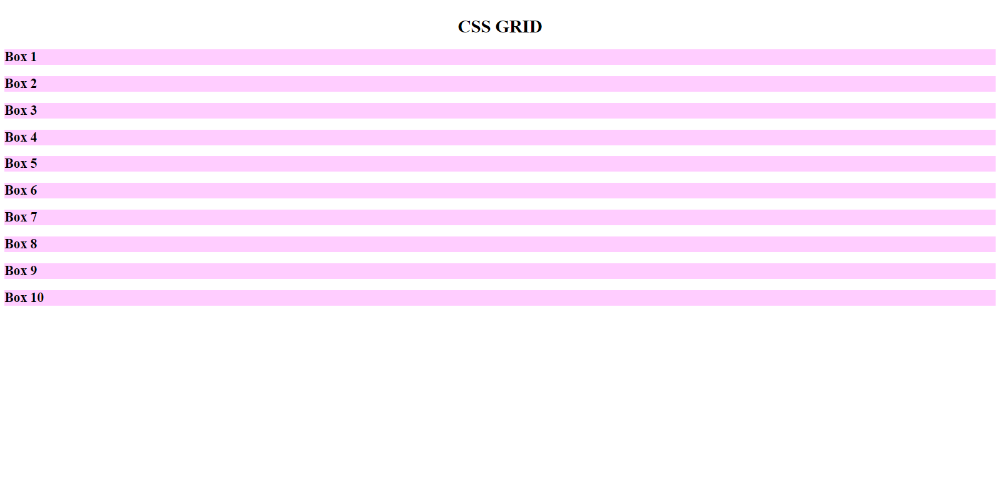

---

### Into the Grid

We now give the `container` the display of grid. At first nothing will happen.

That's because when we create a grid, we need to secify how many rows and columns it should create.

If we write this code, it will create a single column with a width of 100px.

```css
.container {
	display: grid;
	grid-template-columns: 100px;
}
```

.png>)

If we write this, it will create three columns with a width of 100px each.

The number of 100px in the code represents as many columns.

```css
.container {
	display: grid;
	grid-template-columns: 100px 100px 100px;
}
```

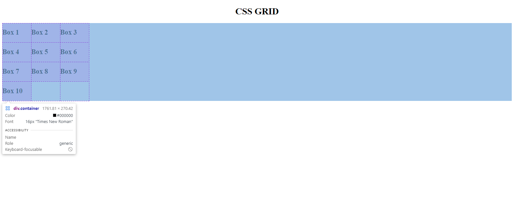

If you call on the browser inspector, and hover over the `container` element, you will see the outline of the grids as shown above.

The same rule goes for the rows. The number of times you repeat a measurement unit as the values of the `grid-template-row` key determines the number of new rows to be created by the grid.

We want to create a grid with 6 rows of 150px height and 4 columns of 150px width.

```css
.container {
	display: grid;
	grid-template-columns: 150px 150px 150px 150px;
	grid-template-rows: 150px 150px 150px 150px 150px 150px;
}
```

When we call the browser inspector we see the outline of the four columns and 6 rows created by the grid.

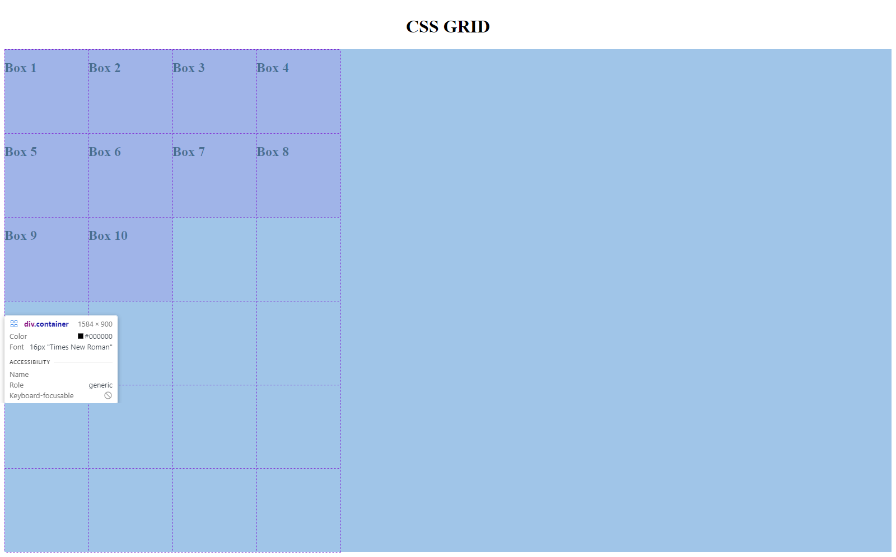

There is a better way to write this but we shall get to it in a moment.

### The Boxes

By default, each box will occupy a single cell in the grid as shown in the previous illustration above.

The remaining cells will be left empty.

We can adjust the size of individual boxes by specifying where each should start and end on both the columns and the rows.

## grid-row-start, grid-row-end, grid-column-start, grid-column-end

Say we want the box labeled "Box 1" to also occupy the entire area currently occupied by Boxes 2, 3, 5, 6 and 7 so that it looks like this:

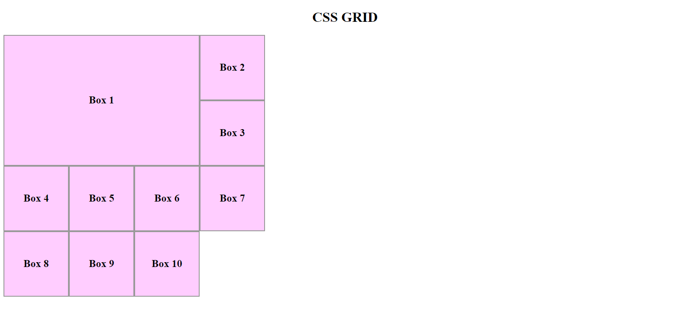

<br>
We can achieve this with the following lines of code:

```css
.box1 {
	grid-row-start: 1;
	grid-row-end: 3;
	grid-column-start: 1;
	grid-column-end: 4;
}
```

In the above code, we begin by specifying the row number where Box-1 will start.
When we say the start of the first grid-row, we mean the very first line of the grid running horizontally which we want the box to touch.

Since we have set the value as 1, it means we want it to be in cotact with the topmost line of the grid.

The outermost boundary is always Line 1.

Then we are specifying that the very last line of the grid running horizontally that Box 1 should be in contact with is Line 3.

That is the third line from the top, couning the outermost boundary of the grid as the first line.

When it comes to the columns of the grid, the same logic applies, only now we are looking at lines running vertically.

The first vertically-running line we want Box 1 to be in contact with is Line 1.
The last vertically-running line we want Box 1 to be in contact with is line 4.

**NOTE:**
**From the illustration above, note that resizing Box 1 diplaces the othe boxes to occupy remaining cells in the grid. That is because we haven't explicitly positioned the remaining boxes.**

## grid-row, grid-column

There is a shothand for writing the above code.

We shall use it to position Box 5.

We want Box 5 to not only occupy cell it currently occupies but to further extend the cells occuped by Box 6 and Box 7.

Compare this image with the one in the previous illustration to see how Box 5 has been resized and positioned in the grid.

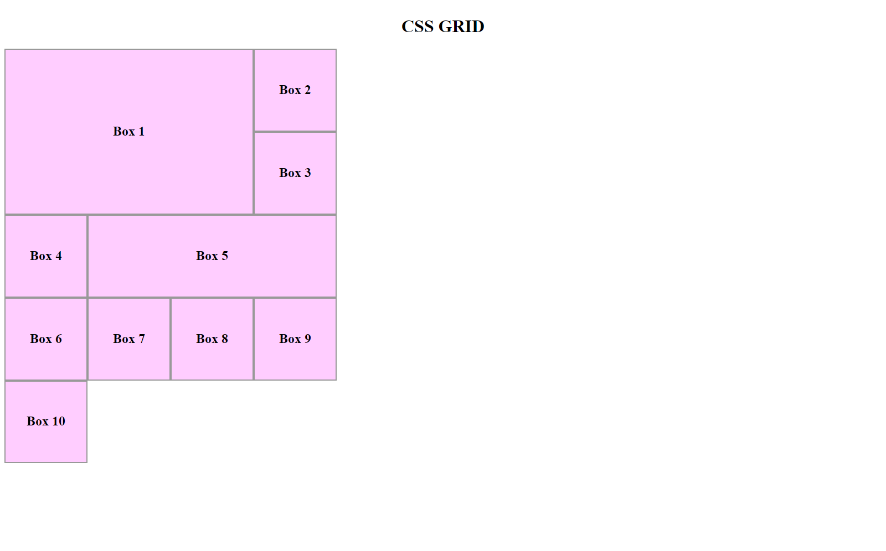

We achieved this using the shorthad of the previous code:

```css
.box5 {
	grid-row: 3 / 4;
	grid-column: 2 / 5;
}
```

The numbers to the left of the forward slash represent start. Those to the right of the forward slash represent end.

We have specified above that we want the first horizontally-running line we want to be in contact with Box 5 is Line 3.

The last horizontal line in contact with Box 5 should be Line 4.

In the below illustrarion which shows the grid cells, you can see that indeed that is the case.

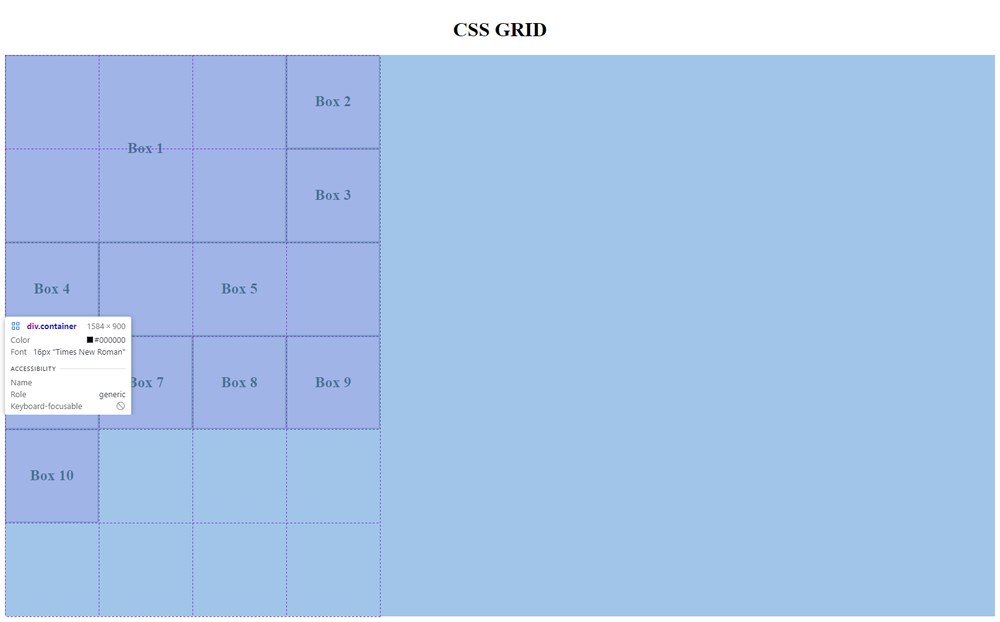

From the top, the first horizontal line in contact with Box 5 is line 3.

In the same manner, the first vertical line in contact with Box 5 in th illustration is Line 2; and the last is Line 5.

## grid-area

Still, there is an even shorter way to write the above code.

Let us use it to size and position Box 8. We want it to leave its current spot and occupy the emply 2x2 square on the bottom of the grid.
_(check last illustration for the gridlines)_

The result should look like this:

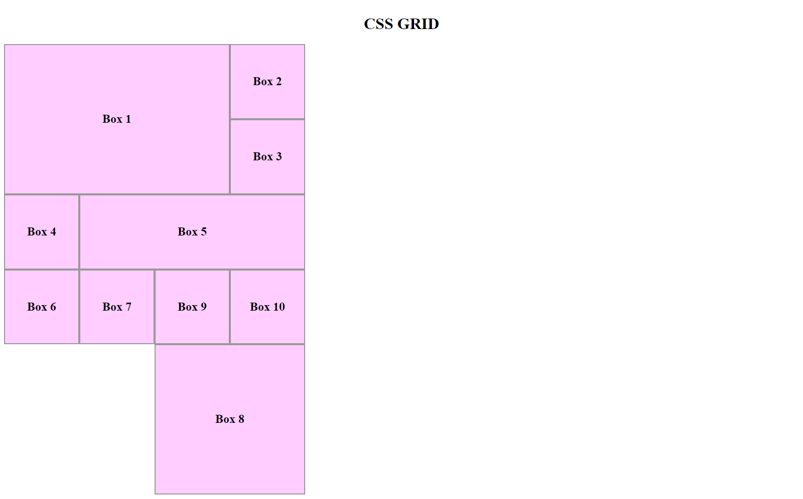

We can do this using the following syntax:

```css
.box8 {
	grid-area: 5 / 3 / 7 /5;
}
```

The four numbers passed as the values for `grid-area` represent, in order:

    i. 		grid-row-start
    ii. 	grid-column-start
    iii. 	grid-row-end
    iv. 	grid-column-end

**NOTE:**
**ALWAYS separate the values in the shorthand methods with a FORWARD SLASH.**

If we view Box 8 as laid over the grid, we can see that it occupies the very last 4 cells in the grid; exactly the spot we wanted it to occupy.

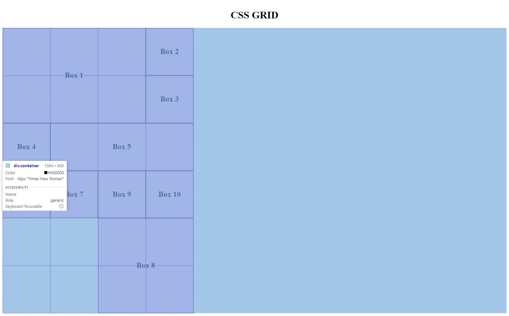

## The span keyword

## grid-row: span _ , grid-column: span _

We can also simply tell a box to span over a certain number cells from its current position.

Whenever we use this method, we consider its current position as the starting point. If we tell it to span over 3 cells, we are really telling it to take just two more steps because we treat its current position as the first step.

Let us instruct Box 6 to span 3 cells downwards from its current position.

The result should look like this:

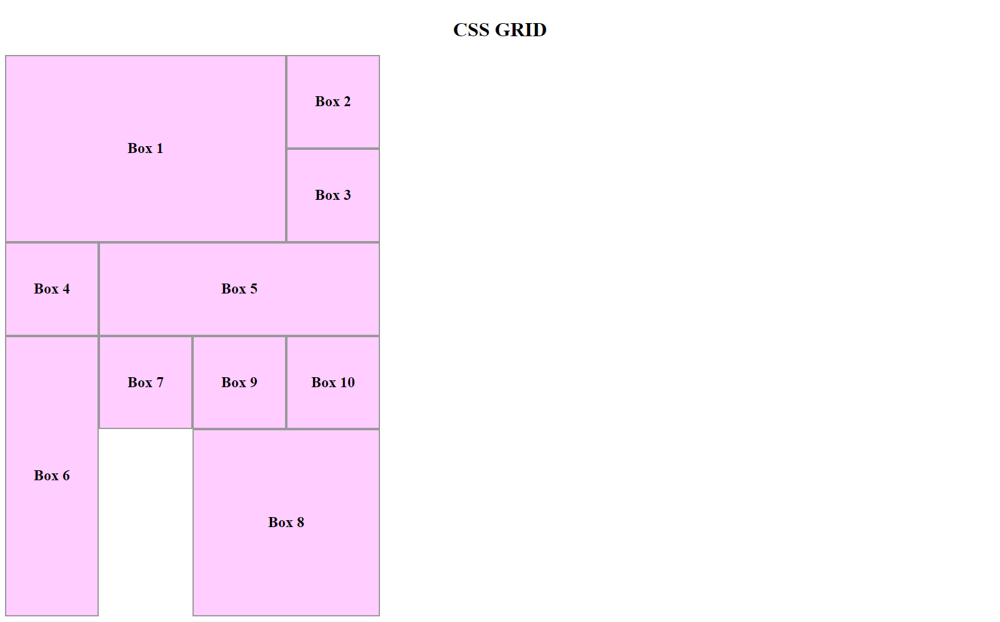

Compare with the previous illstration (without the grid outline) to see where Box 6 was.

To make it span those three boxes, we use the following syntax:

```css
.box6 {
	grid-row: span 3;
}
```

**Note**
While the span property may be a convenient one to use, it has one major downside. When an adjacent element defined using absolute values gets repositoned, the element positioned using span property will simply be displaced.

That means layering cannot be done with an element positioned and/or sized using the span property.
We will see that in action soon.

## Layering in CSS Grid

Remember we started by saying that in CSS Grid we can position things however we please?

But what happens when we position something where another element had been posotioned?

That's where Layering happens. The newly positioned element will simply be stacked on top of the previously-positioned element.

Let's look at Box 3.


We want to resize and reposition it into a 2x2 square so that it occupies one cell in Box 1 and one cell in Box 5.

We shall also give it a different color so that we can truly see the layering at work.

The result should look like this:


You can see the greenish color on Box 3 has spilled into the cells occupied by Box 5 (2 cells) and Box 1 (1 cell).

We positioned Box 3 using the code below and since it found other boxes occupying the cells we assigned it to, it simply layered itself.

```css
.box3 {
	background-color: chartreuse;
	grid-area: 2 / 3 / 4 / 5;
}
```

If we passed one shade of color, why does it render differently in the Box 1 cells and Box 5 cells?

That's because Box 3 has a higher stack level than Box 1 but a lower stack level than Box 5.

In simple terms, Box 3 is stacked above Box 1 hence it appears brighter but then it's stacked below Box 5 hence the dullish appearance.

To change the this, we add a `z-index` property to Box 3 and give it a value above 0.

```css
.box3 {
	background-color: chartreuse;
	grid-area: 2 / 3 / 4 / 5;
	z-index: 1;
}
```

The result should be this:

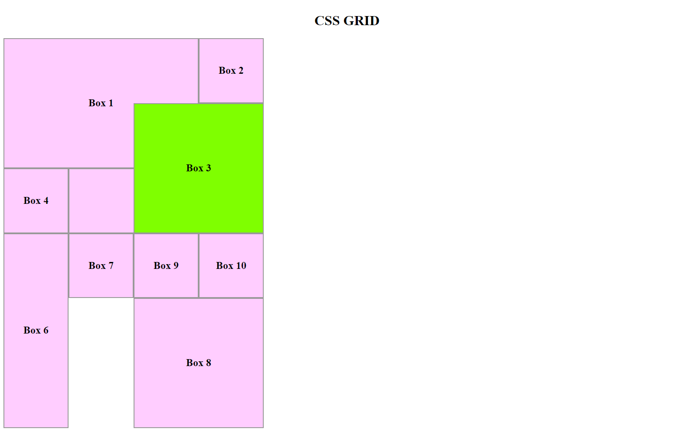

## Layering over an element positioned using the span property

How about we resize and reposition Box 7 into a 2x2 square so that it occupies one cell in Box 6 (_positioned using span property_) and also the blank cell right below it?

Let us also give it a similar color to Box 3 so we can see the layering at work.

We might expect the result to look like this:

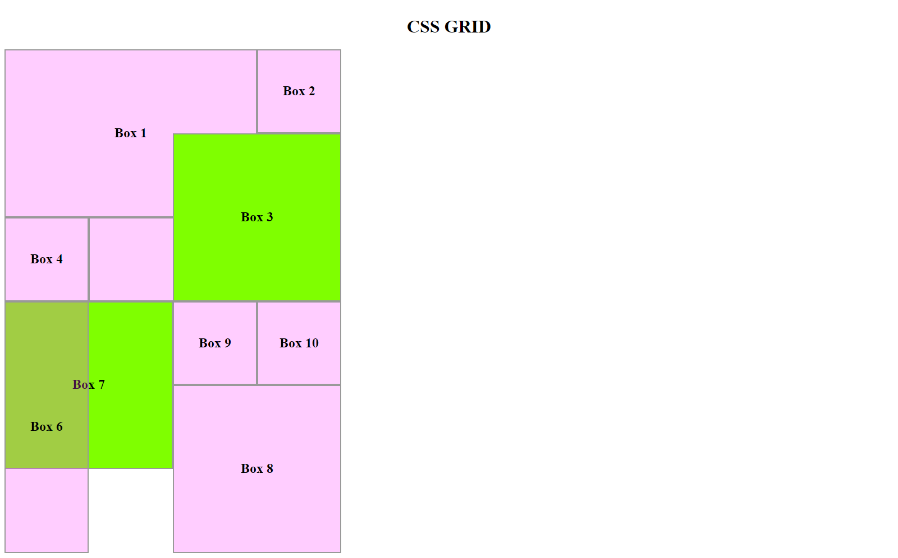

The code to make Box 7 occupy those cells is the one below.

```css
.box7 {
	background-color: chartreuse;
	grid-area: 4 / 1 / 6 / 3;
	z-index: -1;
}
```

####Our result?

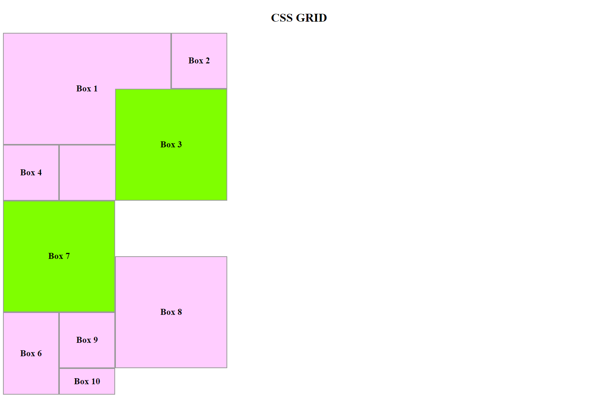

Box 6 has simply been pushed to a different cell.

Why is this the case? Because Box 6 was sized and positioned using the span property.

When a box is positioned using the span property, if a box near it is positioned or repositiined using absolute simply displace it.

A box positioned using the span property cannot be layered like we saw with Box 3 on top of Box 1 and 5.

## Implicit Grids

We started our grid with 24 cells: 4 columns and 6 rows.

If you go to the browser now and call the inspector over the `container` div, you will realize that we now have an extra row and a total of 28 cells.

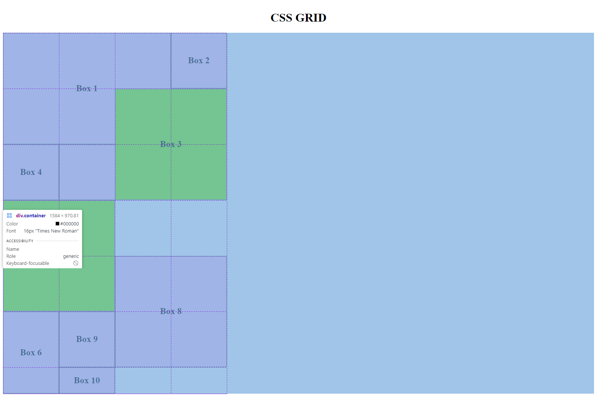

Box 10 is in the extra row and is of a smaller size.

When we've used up all available cells (PS: Not necessarily all the cells, just the ones that CAN be used), Grid creates an _implicit grid_.

An implicit grid is a grid outside of the explicity defined grid.

An implicit grid by default has smaller cells than the explicitly-defined grid. This is because it does not inherit the properties of the grid that we defined and set properties on.

However, we can add a `grid-auto-rows` property to our container to set the size of any implicit grid that gets created by Grid.

Since we started with cells of 150px, we shall set the value of grid-auto-rows to 150px too.

```css
.container {
	display: grid;
	grid-template-columns: 150px 150px 150px 150px;
	grid-template-rows: 150px 150px 150px 150px 150px 150px;
	grid-auto-rows: 150px;
}
```

Now, every time Grid adds a new row, it will be of the same size as the ones we explicitly defined.

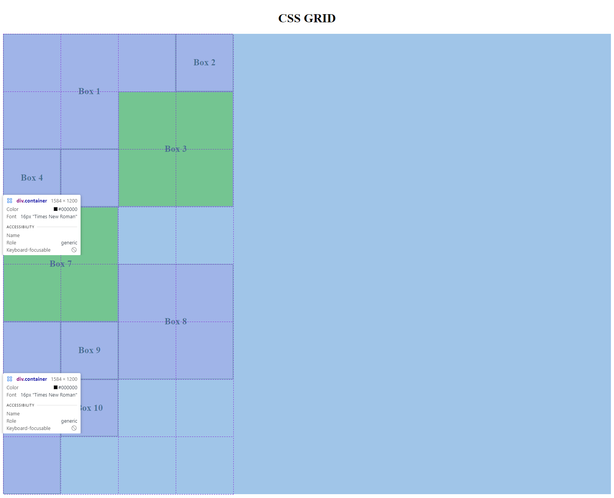

## Implicit grids as columns?

By default, Grid adds implicit grids as rows. What if we'd rather have them as columns?

We do that by invoking the `grid-auto-flow` property on the container and setting its value to "column".

We can also set the size of the implicit grids to ensure conformity but since we have changed our flow to columns, we need to also change the `grid-auto-rows` property to `grid-auto-columns`.

```css
.container {
	display: grid;
	grid-template-columns: 150px 150px 150px 150px;
	grid-template-rows: 150px 150px 150px 150px 150px 150px;
	grid-auto-columns: 150px;
	grid-auto-flow: column;
}
```

The result would be this:

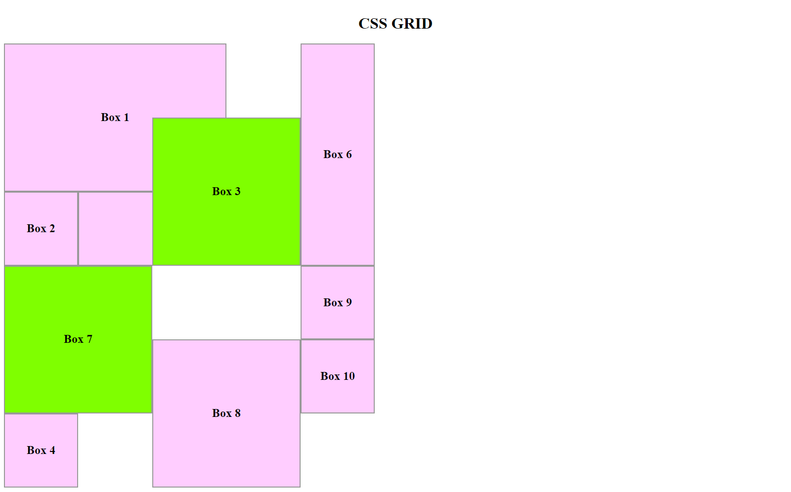

## Segue: How to center a Grid container.

By now you know the running joke amongst Frontend Developers: How to center a Div.

CSS has, however, since come a long way and divs/elements can be centered with just a few lines of codes.

How do we center a grid container?

Simply add a `place-content` property to the grid container and assign it a value of `center`.

```css
.container {
	display: grid;
	grid-template-columns: 150px 150px 150px 150px;
	grid-template-rows: 150px 150px 150px 150px 150px 150px;
	grid-auto-columns: 150px;
	grid-auto-flow: column;
	place-content: center;
}
```

The result is this:

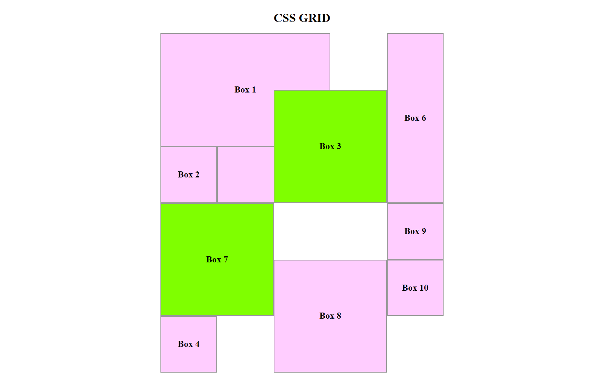

It's the exact same container from the previous example, only now centered.

Moving forward, our grid container will be centered on the page.

## Better ways to create Grid containers

I said that we would look at better ways to create a grid container.

That time is now.

Instead of writing this repetitive code like we did:

```css
.container {
	display: grid;
	grid-template-columns: 150px 150px 150px 150px;
	grid-template-rows: 150px 150px 150px 150px 150px 150px;
}
```

We could rewrite it using a `repeat` notation.

The `repeat` notation takes two arguments:

    i. The first argument is the number of times you want to repeat a value.
    ii. The second argument is value you want repeated.

Since we repeated 150px four times in the column and six times in the row, we could refactor this as follows:

```css
.container {
	display: grid;
	grid-template-columns: repeat(4, 150px);
	grid-template-rows: repeat(6, 150px);
	grid-auto-columns: 150px;
	grid-auto-flow: column;
	place-content: center;
}
```

The result remains the same.


## Gap between Grid items.

You can add a gap property in the grid container to space the items.

If you assign the gap property a single value it will assign gaps equally to both the rows and columns.

```css
.container {
	display: grid;
	grid-template-columns: repeat(4, 150px);
	grid-template-rows: repeat(6, 150px);
	grid-auto-columns: 150px;
	grid-auto-flow: column;
	place-content: center;
	grid-gap: 10px;
}
```
Notice the gaps are assigned equally between both the rows and columns.

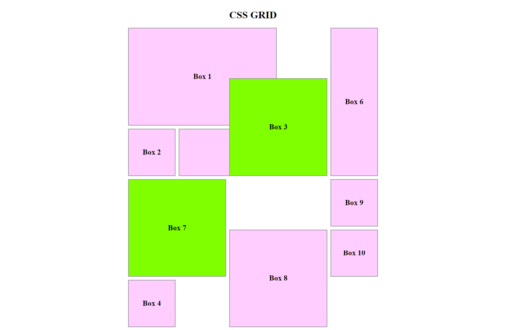

If you assign the gap property two values, it will use the first value to set the gaps on the rows and the second value to set gaps columns.

```css
.container {
	display: grid;
	grid-template-columns: repeat(4, 150px);
	grid-template-rows: repeat(6, 150px);
	grid-auto-columns: 150px;
	grid-auto-flow: column;
	place-content: center;
	gap: 20px 10px;
}
```
Notice that now the gap between rows is twice as big as the gap between columns. That's because the first value (20px) was used to set the gap between rows and the second value (10px) was used to set the gap between columns.


